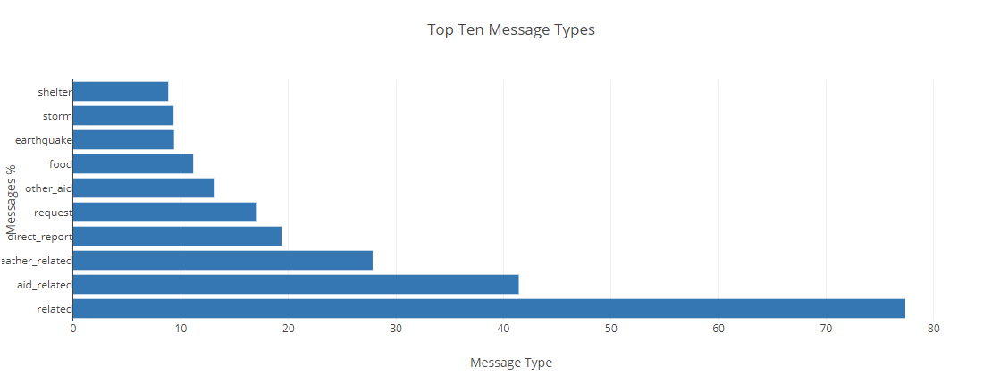

# Disaster Response Pipelines - Data Engineering Project
### Udacity Data Scientist Nanodegree 

## Table of Contents
1. [Description](#description)
2. [Getting Started](#getting_started)
	1. [Dependencies](#dependencies)
	2. [Installing](#installation)
	3. [Executing Program](#execution)
	4. [Notebooks](#notebooks)
3. [Licensing, Authors, Acknowledgements](#authors)
4. [Screenshots](imgs)

<a name="descripton"></a>
## Description

This app aims to analyze messages sent during natural disasters via social media or disaster response organizations. It analyzes disaster data from Figure Eight to build a model for an API that classifies disaster messages. 

It contains three modules:

1. An ETL pipeline that processes messages and category data from csv files and load them into a SQL database;
2. A ML pipeline that will read from the database to create and save a multi-output supervised machine learning model;
3. A web app that will extract data from this database to provide data visualisations and use the model to classify new messages for 36 categories.

<a name="getting_started"></a>
## Getting Started

<a name="dependencies"></a>
### Dependencies

Check out ```requirements.txt```

* Python 3.5+
* Data Processing Libraries: NumPy, Pandas
* Machine Learning Library: Sciki-Learn (version 0.23.0), XGBoost
* Natural Language Process Library: NLTK
* SQLlite Database Libraqry: SQLalchemy
* Model Loading and Saving Library: Pickle
* Web App and Data Visualization: Flask, Plotly (version 2.7.0)

<a name="installation"></a>
### Installing
To clone the git repository:
```
git clone https://github.com/AnaHristian/disaster-response-pipeline-dsnd.git
```
<a name="execution"></a>
### Executing Program:

1. You can run the following commands in the project's directory to set up the database, train model and save the model.

    - To run ETL pipeline to clean data and store the processed data in the database
        `python data/process_data.py data/disaster_messages.csv data/disaster_categories.csv data/disaster_response_db.db`
    - To run the ML pipeline that loads data from DB, trains classifier and saves the classifier as a pickle file
        `python models/train_classifier.py data/disaster_response_db.db models/classifier.pkl`

2. Run the following command in the app's directory to run your web app.
    `python run.py`

3. Go to http://0.0.0.0:3001/

<a name="notebooks"></a>

### Jupyter Notebooks

In order to better understand how this app was built, I attached the two notebooks where I have created the ETL pipeline and the Machine Learning Pipeline.
1. ETL notebook: 
2.
	a. read the dataset ;
	b. clean the data;
	c. store it in a SQLite database. 
2. ML notebook

	a. split the data into a training set and a test set;
	b. create a machine learning pipeline that uses NLTK;
	c. use scikit-learn's Pipeline and GridSearchCV to output a final model that uses the message column to predict classifications for 36 categories (multi-output classification);
	d. export the model to a pickle file.


<a name="importantfiles"></a>
### Important Files
**app/templates/***: templates/html files for web app

**data/process_data.py**: Extract Train Load (ETL) pipeline used for data cleaning, feature extraction, and storing data in a SQLite database

**models/train_classifier.py**: A machine learning pipeline that loads data, trains a model, and saves the trained model as a .pkl file for later use

**run.py**: This file can be used to launch the Flask web app used to classify disaster messages

<a name="authors"></a>
## Licensing, Authors, Acknowledgements

Must give credit to [Figure Eight](https://appen.com/) for the data. Feel free to use the code here as you would like!

[](https://opensource.org/licenses/MIT)

<a name="imgs"></a>
## Screenshots



